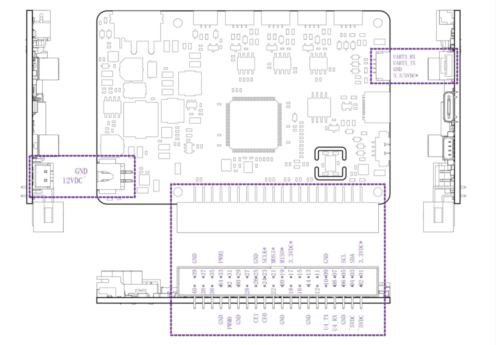
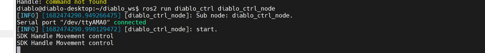
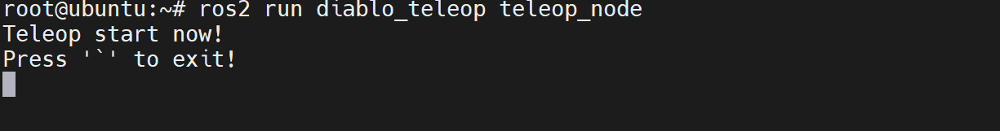
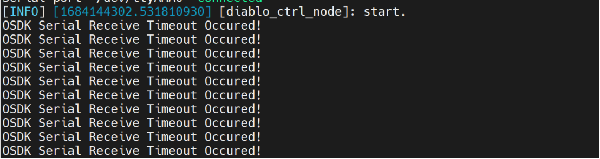
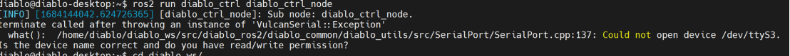

<p align="center"><strong>DIABLO ROS2</strong></p>
<p align="center"><a href="https://github.com/DDTRobot/diablo_sdk_v2/blob/main/LICENSE"></a>


</p>


<p align="center">
    语言：<a href="./docs/docs_en/README_EN.md"><strong>English</strong></a> / <strong>中文</strong>
</p>


​	基于串口通信的 `DIABLO` 机器人二次开发控制接口，您可以通过 `ROS2` 快速上手。如果您想要不通 `ROS` 进行开发，也可以在 [ROS](https://github.com/DDTRobot/diablo-sdk-v1) 中修改 `CMakeLists` 的方式只对源码进行编译。我们将不断的更新 `ROS2` 的功能节点 , 希望能对您的机器人开发有所帮助。

---


## Basic Information 基本信息

- `X3pi` 默认用户是 `root` , 密码为 `root`

-  树莓派中默认用户是 `diablo` ,密码为 `diablo123`

- `X3pi` 中IO默认串口号是 `/dev/ttyS3`

  > 树莓派中IO默认串口号是 `/dev/ttyAMA0`,如果您使用自定义的镜像，请[重新配置串口映射](https://diablo-sdk-docs.readthedocs.io/en/latest/pages/Installation/installing-sdk-on-pi.html)
  >
  > 您可以通过修改 [Hal.init("/dev/ttyS3")](./diablo_interaction/diablo_ctrl/src/diablo_ctrl.cpp) 并重新编译达到切换硬件的目的

- `ROS_DOMAIN_ID=5` , 可通过 `export ROS_DOMAIN_ID=5` 连接并控制局域网中 `DIABLO` 的功能节点。


## 主控制引脚说明



## Installation 安装

| Installation method | Supported platform[s] | Development Docs    | Official website                         |
| ------------------- | --------------------- | ------------------- | ---------------------------------------- |
| Source              | Linux , ros-foxy      | [DIABLO 开发手册](https://diablo-sdk-docs.readthedocs.io/en/latest/index.html) | [Direct drive](https://directdrive.com/) |

**您可以在大多数 `Linux` 设备中,编译我们的 SDK 源码。或者在支持 ros-foxy 的设备中直接编译我们提供的 ros 包，注意编译之前需要做[重新配置串口映射](https://diablo-sdk-docs.readthedocs.io/en/latest/pages/Installation/installing-sdk-on-pi.html)，到达切换硬件设备。**


## Quick Start 快速开始

#### 准备工作
#### 在连接机器人之前，需要做下述准备工作：
##### 显示
开发板支持HDMI显示接口，通过HDMI线缆连接开发板和显示器，支持图形化桌面显示。
##### 网络连接
开发板支持有线以太网、无线WiFi两种网络接口，用户可通过任意接口实现网络连接功能。
##### 登录系统
开发板支持Ubuntu 20.04 Desktop、Server两个系统版本，用户结合个人习惯自由选择使用，以获得更自由的体验。如果用户更熟悉命令行交互操作方式，可以使用不带图形化桌面的Ubuntu Server版本。
#### **在此之前，机器人出厂已经部署ROS2驱动包无需用户自行部署，跳过ros_ws创建，如做了硬件设备切换，需要做重新部署**
1. 创建ros工程文件夹

```bash
#make sure you have build all dependence.

sudo apt-get install python3-colcon-common-extensions
mkdir -p ~/diablo_ws/src
cd ~/diablo_ws/src

#clone API source code
git clone -b basic https://github.com/DDTRobot/diablo_ros2.git

cd ~/diablo_ws
colcon build
source install/setup.bash

#before starting the node , please check of serial port in diablo_ctrl.cpp is correct.
ros2 run diablo_ctrl diablo_ctrl_node

#run controller python script
ros2 run diablo_teleop teleop_node 
```

2. 完整版编译

```bash
#make sure you have build all dependence.

sudo apt-get install python3-colcon-common-extensions python3-pip
sudo pip3 install rosdep
sudo rosdep init
rosdep update
mkdir -p ~/diablo_ws/src
cd ~/diablo_ws/src

#clone API source code
git clone https://github.com/DDTRobot/diablo_ros2.git
cd ~/diablo_ws
rosdep install -i --from-path src --rosdistro foxy -y

colcon build
source install/setup.bash

#before starting the node , please check of serial port in diablo_ctrl.cpp is correct.
ros2 run diablo_ctrl diablo_ctrl_node

#run controller python script
ros2 run diablo_teleop teleop_node 
```

## Example 例子

1、开启第一个终端，输入以下命令，获取控制权限
```
ros2 run diablo_ctrl diablo_ctrl_node
```
执行成功之后终端输出一下信息：


打开另一个终端：输入以下命令，键盘控制
```
 ros2 run diablo_teleop teleop_node
```
执行成功之后终端输出一下信息:

**注意：** 操纵前需求遥控手柄进行关机，否则按下键盘无反应。

##### 操作说明：
```
w：控制机器人向前移动。 （-1.0~+1.0米/秒）; （-1.6~+1.6米/秒Low-speed mode::High-speed mode::
s：控制机器人向后移动。 （-1.0~+1.0米/秒）; （-1.6~+1.6米/秒Low-speed mode::High-speed mode::
a：控制机器人左转。 （-5.0~+5.0 弧度/秒）Arbitrarily mode::
d：控制机器人右转。 （-5.0~+5.0 弧度/秒）Arbitrarily mode::
q：控制机器人向左倾斜。 （-0.2~+0.2弧度/秒）Standing mode::
e：控制机器人向右倾斜。 （-0.2~+0.2弧度/秒）Standing mode::
r：将机身倾斜角度调整为水平。Standing mode:
z：将机器人切换到站立模式。
x：将机器人切换到爬行模式。
v：用于提升机器人的控制模式。 （0 ~ 1）Position mode 0:
b：用于提升机器人的控制模式。 （-0.25 ~ +0.25 米/秒）Position mode 1:
n：用于机器人头部俯仰的控制模式。 （0 ~ 1）Position mode 0:
m：用于机器人头部俯仰的控制模式。 （-0.3~ +0.3 弧度/秒）Position mode 1:
h：站立模式下的最小高度。Position mode
k：站立模式下的中等高度。Position mode
j：站立模式下的最大高度。Position mode
u：控制机器人上仰。Position mode
i：将机身调整为水平。Position mode
o：控制机器人下仰。Position mode
f：太空步。dance mode
g：太空步结束。dance mode
c：跳跃模式。Jump mode
`：退出虚拟遥控器。
```

## diablo ROS API说明

### 1.diablo_ctrl_node
diablo_ctrl_node节点包括它发布的Topic、订阅的Topic以便其他节点能够正确地与其交互。
### 2.可订阅的Topic接口
**Topic 名称:**  
```
/diablo/MotionCmd
/diablo/sensor/Battery
/diablo/sensor/Body_state
/diablo/sensor/Imu
/diablo/sensor/ImuEuler
/diablo/sensor/Motors 
```
### 3.控制API
diablo控制封装成ros2 topic 形式让客户端能控制机器人运行服务
#### 明细
#### 功能概述：进入站立模式、控制站立姿态、控制高度、前进左右、pitch、roll .
#### Topic :```/diablo/MotionCmd```
##### Msg Type s-e：```motion_msgs/msg/MotionCtrl```
##### 命令示例:
 ```
 ros2 topic pub /diablo/MotionCmd motion_msgs/msg/MotionCtrl "{mode_mark: false, value: {forward: 0.0, left: 0.0, up: 0.0, roll: 0.0, pitch: 0.0, leg_split: 0.0}, mode: {pitch_ctrl_mode: false, roll_ctrl_mode: false, height_ctrl_mode: false, stand_mode: false, jump_mode: false, split_mode: false}}"
```
##### 字段描述:
对于MotionCtrl消息中的mode_mark，将其设置为true意味着你正在发送模式设定命令，而不是直接的移动控制命令。在模式设定命令中，你可以设置机器人进入某个特定的操作模式，比如站立模式、跳跃模式等。例如：需要设定机器人进入站立模式并改变高度控制。可以发送以下命令：
```
msg->mode_mark = true;
 msg->mode.stand_mode = true;
 msg->value.up = 1.0;  //改变up 值从而改变高度
 motion_publisher->publish(msg);
```
假设不进行模式设定，意味着mode_mark设置false 。
更多控制示例参考：teleop.py

---
### 4.IMU传感器信息
传感器信息包括IMU、电源系统、6个电机数据等数据的获取和调用

#### 明细
##### IMU 数据
##### 功能概述：获取快速的50hz imu 四元数、角速度、加速度等数据
##### Topic:```/diablo/sensor/Imu```
##### Msg Type s-e：```sensor_msgs/msg/Imu```
##### 命令示例：```ros2 topic echo /diablo/sensor/Imu```
---
##### IMU Euler 数据
##### 功能概述：获取快速的50hz imuEuler pitch、roll、yaw 等数据
##### Topic:```/diablo/sensor/ImuEuler```
##### Msg Type s-e：```ception_msgs/msg/IMUEuler```
##### 命令示例：```ros2 topic echo /diablo/sensor/ImuEuler```
---
### 5.电机API
电机API用于获取六个电机的状态及腿长
#### 明细
##### 功能概况：读取六个电机状态信息及左右腿长
##### Topic :```/diablo/sensor/Motors``` 
##### Msg Type s-e：```motion_msgs/msg/LegMotors```
##### 命令示例：```ros2 topic echo /diablo/sensor/Motors```
##### 字段描述:
* header：用于更高级别的带时间戳的数据类型的标准元数据。此字段用于传递时间戳和坐标帧信息;
* enc_rev: 圈数;
* pos: 位置 ,单位rad;
* vel: 角速度，单位rad/s;
* iq:  电流，单位A;
* leg_length: 腿长，单位m;
---
### 6.电源系统API 
电源系统的API只能对电池信息等信息数据查看
#### 明细
#### 功能概况：订阅Topic反馈电源信息
#### Topic:  ``` /diablo/sensor/Body_state```
##### Msg Type s-e：``` sensor_msgs/msg/Battery```
##### 命令示例：```ros2 topic echo /diablo/sensor/Battery```
##### 字段描述:
* header：用于更高级别的带时间戳的数据类型的标准元数据。此字段用于传递时间戳和坐标帧信息;
* voltage: 电压，单位V;
* current: 母线电流 ,单位A;
* percentage: 剩余电量
---
### 7.机器人状态信息 
机器人状态信息反馈如异常、未初始化等等，可用于自查故障、警告等问题
#### 明细
#### 功能概况：订阅Topic反馈电源信息
#### Topic:  ``` /diablo/sensor/Body_state```
##### Msg Type s-e：``` motion_msgs/msg/RobotStatus```
##### 命令示例：```ros2 topic echo /diablo/sensor/Battery```
##### 字段描述:
* header：用于更高级别的带时间戳的数据类型的标准元数据。此字段用于传递时间戳和坐标帧信息;
* ctrl_mode_msg: 机器人控制状态
* robot_mode_msg: 机器人模式状态
* error_msg: 机器人错误状态码
* warning_msg:机器人警告状态码
#### 状态代码
* ctrl_mode_msg = 1 ; sdk 控制控制权限模式
* robot_mode_msg = 2; 匍匐状态
* robot_mode_msg = 3 ; 站立状态 
* robot_mode_msg = 4 ; 站立状态过渡到匍匐状态
* robot_mode_msg = 5 ; 匍匐状态过渡到站立状态

* error_msg = 2064384 ; 6个电机断连，如有其他状态码反馈DDT FAE 协助诊断解决，warning_msg 状态码 亦如此。
--- 

## FAQ
* [1 问题]

* [1 解决方法]
-  确保你在GitHub上clone的是basic分支的diablo_ros2
-  检查开发板与机器人控制板连接的40p线是否连接好或者存在虚接

* [2 问题]

* [2 解决方法]
- 解决方将diablo_ctrl.cpp 中Hal.init(“/dev/ttys3”)改为你的设备正确的端口,保存并重新编译。
## Contents 目录

以下为Ros2 节点目录 :

* [机器人传感器感知模块](./diablo_ception)

  > [机器人内置传感器](./diablo_ception/diablo_body)

* [机器人SDK与通用方法模块](./diablo_common)

* [机器人控制交互模块](./diablo_interaction)

  > [获取机器人SDK控制权限](./diablo_interaction/diablo_ctrl)
  >
  > [捕获键盘输入信息](./diablo_interaction/diablo_teleop)

* [ROS自定义消息模块](./diablo_interfaces)

  > [机器人基础控制信息](./diablo_interfaces/motion_msgs)

* [Ros可视化仿真模块](./diablo_visualise)

  > [Ros rviz2 gazebo simulation](./diablo_visualise/diablo_simulation)
  >
  > [Rviz2 自定义遥控器界面](./diablo_visualise/diablo_rviz2_plugin)
  >
  > [电机角度转Rviz2显示角度](./diablo_visualise/diablo_simpose_trans)


[def]: ./docs/img/diablo_board.jpg