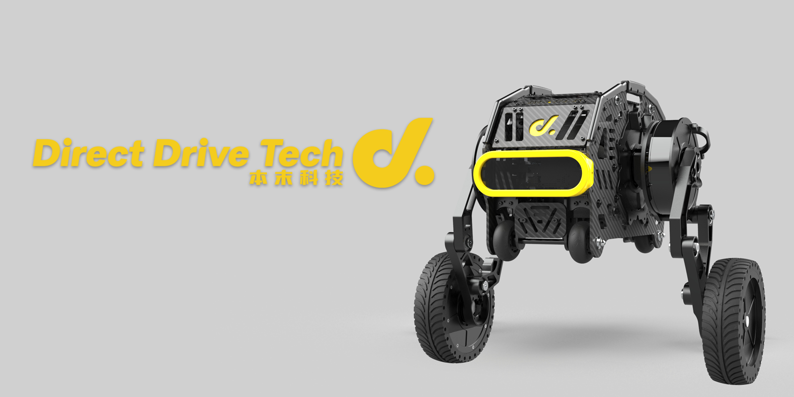

<p align="center"><strong>DIABLO ROS2</strong></p>
<p align="center"><a href="https://github.com/DDTRobot/diablo_sdk_v2/blob/main/LICENSE"></a>


</p>


<p align="center">
    语言：<a href="./docs/docs_en/README_EN.md"><strong>English</strong></a> / <strong>中文</strong>
</p>


​	基于串口通信的 `DIABLO` 机器人二次开发控制接口，您可以通过 `ROS2` 快速上手。如果您想要不通 `ROS` 进行开发，也可以在 [ROS](https://github.com/DDTRobot/diablo-sdk-v1) 中修改 `CMakeLists` 的方式只对源码进行编译。我们将不断的更新 `ROS2` 的功能节点 , 希望能对您的机器人开发有所帮助。

---



## Basic Information 基本信息

- `X3pi` 默认用户是 `root` , 密码为 `root`

  > 树莓派中默认用户是 `diablo` ,密码为 `diablo123`

- `X3pi` 中IO默认串口号是 `/dev/ttyS3`

  > 树莓派中IO默认串口号是 `/dev/ttyAMA0`
  >
  > 您可以通过修改 [Hal.init("/dev/ttyS3")](./diablo_interaction/diablo_ctrl/src/diablo_ctrl.cpp) 并重新编译达到切换硬件的目的

- `ROS_DOMAIN_ID=5` , 可通过 `export ROS_DOMAIN_ID=5` 连接并控制局域网中 `DIABLO` 的功能节点。


## Installation 安装

| Installation method | Supported platform[s] | Development Docs    | Official website                         |
| ------------------- | --------------------- | ------------------- | ---------------------------------------- |
| Source              | Linux , ros-foxy      | [DIABLO 开发手册]() | [Direct drive](https://directdrive.com/) |

您可以在大多数 `Linux` 设备中编译我们的 SDK 源码。或者在支持 ros-foxy 的设备中直接编译我们提供的 ros 包。


## Contents 目录

以下为Ros2 节点目录 :

* [Robot ception node](./diablo_ception)

  > [Robot carrier sensor](./diablo_ception/diablo_body)

* [SDK source code and common fuction](./diablo_common)

* [Robot firing sdk and ctrl](./diablo_interaction)

  > [Start sdk ctrl](./diablo_interaction/diablo_ctrl)
  >
  > [Capture keyboard event](./diablo_interaction/diablo_teleop)

* [Ros custom msgs](./diablo_interfaces)

  > [Robot basic movement ctrl msg](./diablo_interfaces/motion_msgs)

* [Ros rviz2 and gazebo example](./diablo_visualise)

  > [rviz2 rviz2 gazebo simulation](./diablo_visualise/diablo_simulation)
  >
  > [rviz2 Qt teleop UI](./diablo_visualise/diablo_rviz2_plugin)
  >
  > [motor angle 2 urdf angle](./diablo_visualise/diablo_simpose_trans)

  

## Quick Start 快速开始

1. 创建ros工程文件夹

```bash
#make sure you have build all dependence.

sudo apt-get install python3-colcon-common-extensions
mkdir -p ~/catkin_ws/src
cd ~/catkin_ws/src

#clone API source code
git clone -b basic https://github.com/DDTRobot/diablo_sdk_v2.git

cd ~/catkin_ws
colcon build
source install/setup.bash

#before starting the node , please check of serial port in diablo_ctrl.cpp is correct.
ros2 run diablo_ctrl diablo_ctrl_node

#run controller python script
ros2 run diablo_teleop teleop_node 
```

