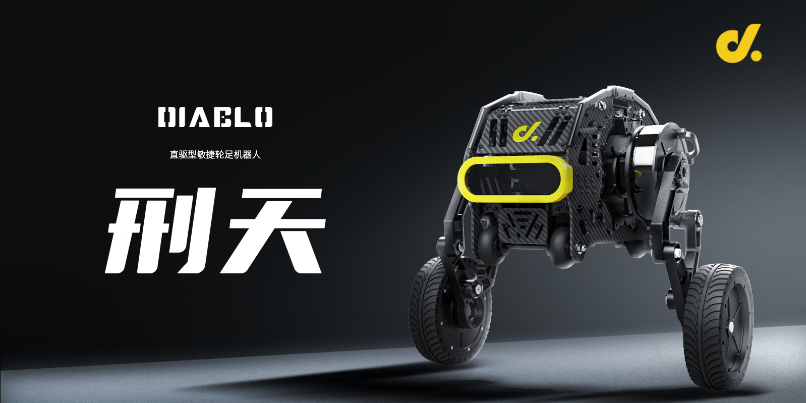

<p align="center"><strong>DIABLO ROS2</strong></p>
<p align="center"><a href="https://github.com/Direcrt-Drive-Technology/diablo-sdk-v1/blob/master/LICENSE"></a>


</p>


<p align="center">
    语言：<a href="README.en.md"><strong>English</strong></a> / <strong>中文</strong>
</p>


​	The diablo sdk based on serial communication, you can get started quickly through `ros2`. If you want to develop without ROS, you can also modify `CMakeLists` in [ROS](https://github.com/DDTRobot/diablo-sdk-v1) to compile only the source code.We will constantly update the package of `ros2`, hoping to be helpful for your robot development.

---



## Basic Information 

- `X3pi` The default user is `root`  and the password `root`

  > `Raspberry pi` The default user is `diablo`  and the password `diablo123`

- `X3pi` The default serial port number of IO is `/dev/ttyS3`

  > `Raspberry pi` The default serial port number of IO is `/dev/ttyAMA0`
  >
  > You can switch hardware by modifying [Hal.init("/dev/ttyS3")](./diablo_interaction/diablo_ctrl/src/diablo_ctrl.cpp) and recompiling

- `ROS_DOMAIN_ID=5` , You can use `export ROS_ DOMAIN_ Id=5` connect and control the `Diablo` function node in the LAN.


## Installation 

| Installation method | Supported platform[s] | Development Docs  | Official website                         |
| ------------------- | --------------------- | ----------------- | ---------------------------------------- |
| Source              | Linux , ros-foxy      | [DIABLO Manual]() | [Direct drive](https://directdrive.com/) |

You can compile our SDK source code in most `Linux` devices. Or directly compile the ROS package provided by us in the device that supports ROS foxy.

  

## Quick Start 

1. Create ros project workspace

```bash
#make sure you have build all dependence.

sudo apt-get install python3-colcon-common-extensions
mkdir -p ~/diablo_ws/src
cd ~/diablo_ws/src

#clone API source code
git clone -b basic https://github.com/DDTRobot/diablo_ros2.git

cd ~/diablo_ws
colcon build
source install/setup.bash

#before starting the node , please check of serial port in diablo_ctrl.cpp is correct.
ros2 run diablo_ctrl diablo_ctrl_node

#run controller python script
ros2 run diablo_teleop teleop_node 
```


## Contents 

The following is the ros2 node Directory:

* [Robot ception node](../../diablo_ception)

  > [Robot carrier sensor](../../diablo_ception/diablo_body)

* [SDK source code and common fuction](../../diablo_common)

* [Robot firing sdk and ctrl](../../diablo_interaction)

  > [Start sdk ctrl](../../diablo_interaction/diablo_ctrl)
  >
  > [Capture keyboard event](../../diablo_interaction/diablo_teleop)

* [Ros custom msgs](../../diablo_interfaces)

  > [Robot basic movement ctrl msg](../../diablo_interfaces/motion_msgs)

